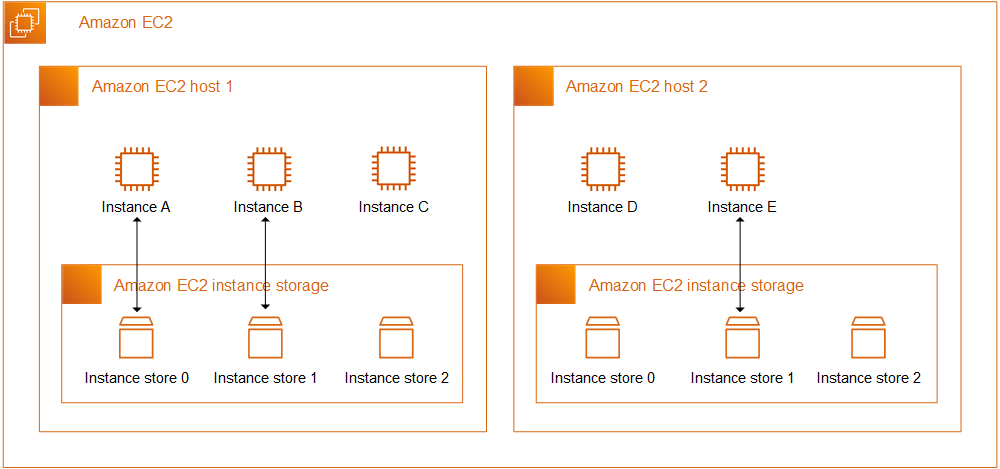

# 3. EC2

### 1. 개요

1. [Elastic Compute Cloud](https://aws.amazon.com/ko/ec2/faqs/)
2. IaaS
3. 클라우드에서 컴퓨팅 파워의 규모를 자유자재로 변경할 수 있는 웹 서비스

### 2. 인스턴스 유형

1. 가속 컴퓨팅
   1. 하드웨어 액셀러레이터 또는 코프로세서를 사용하여 부동 소수점 수 계산이나 그래픽 처리 등 일부 함수를 CPU에서 실행되는 소프트웨어보다 
   2. 훨씬 효율적으로 수행할 수 있는 인스턴스 패밀리입니다.
2. 버스트 가능
   1. 기본 수준의 CPU 성능과 더불어 기본 수준을 넘어 버스트할 수 있는 기능을 제공
3. 컴퓨팅 최적화
   1. 고성능 컴퓨팅 파워를 활용할 수 있는 애플리케이션에 맞게 설계
   2. 고성능 웹 서버, 고성능 컴퓨팅(HPC), 과학 모델링, 분산 분석 및 기계 학습 추론과 같은 컴퓨팅 집약적 애플리케이션이 포함
4. HPC 최적화(고성능 컴퓨팅 최적화)
5. 범용
6. 대용량 메모리
   1. 단일 인스턴스에서 3TiB, 6TiB, 9TiB, 12TiB, 18TiB 또는 24TiB 메모리를 제공
   2. SAP HANA의 프로덕션 설치를 비롯하여 클라우드에서 대규모 인 메모리 데이터베이스를 실행하도록 설계
7. 메모리 최적화
   1. 인 메모리 애플리케이션, 인 메모리 데이터베이스, 인 메모리 분석 솔루션, 고성능 컴퓨팅(HPC), 과학 컴퓨팅 및 기타 메모리 집약적 애플리케이션을 포함하여, 
   2. 메모리 사용량이 많은 애플리케이션을 위해 큰 메모리 크기를 제공
8. 이전 세대
9. 스토리지 최적화

### 3. 비용 및 용량 최적화

1. 사용한만큼만 지불
   1. 초당 결제
2. [Amazon EC2 Auto Scaling](https://aws.amazon.com/ko/ec2/autoscaling/)으로 원활하게 확장
3. Amazon EC2 플릿으로 컴퓨팅 성능 및 비용 최적화
4. 최적화된 CPU 구성
5. 인스턴스 일시 중지 및 다시 시작

### 4. 스토리지

1. EBS
   1. 인스턴스와 함께 사용하기 위해 지속적이고 가용성이 높으며 일관되고 대기 시간이 짧은 **블록 스토리지** 볼륨을 제공
2. EFS
   1. 공유 액세스를 위해 간단하고 확장 가능하며 영구적인 완전관리형 클라우드 **파일 스토리지**를 제공

### 5. 네트워킹

1. 향상된 네트워킹을 통한 높은 PPS 성능 및 짧은 대기 시간
2. Elastic Fabric Adapter로 높은 수준의 노드 간 통신 실행
   1. EC2 인스턴스를 위한 네트워크 인터페이스
   2. 고객이 기계 학습, 전산 유체 역학, 기후 모델링, 저장소 시뮬레이션과 같이 
   3. 높은 수준의 인스턴스 간 통신이 필요한 애플리케이션을 AWS에서 대규모로 실행할 수 있도록 지원
3. 탄력적 IP 주소로 동적 클라우드 컴퓨팅 서비스 관리
   1. 동적 클라우드 컴퓨팅을 위해 설계된 고정 IP 주소
4. 고성능 컴퓨팅(HPC) 클러스터를 통한 높은 처리량 및 짧은 대기 시간
5. AWS PrivateLink로 AWS에 호스팅된 서비스에 쉽고 안전하게 액세스

### 6. 운영 체제 및 소프트웨어

1. Amazon Linux 2
2. Ubuntu
3. Red Hat Enterprise Linux 
4. CentOS 
5. SUSE 
6. Debian
7. Windows

### 7. [보안 그룹](https://docs.aws.amazon.com/ko_kr/AWSEC2/latest/UserGuide/ec2-security-groups.html)

1. 정의
   1. EC2 인스턴스에 대한 수신 및 발신 트래픽을 제어하는 가상 방화벽 역할
2. 특징
   1. 기본적으로 모든 아웃바운드 트래픽을 허용. 해당 특성은 삭제 가능.
   2. 항상 허용적이므로 액세스를 거부하는 규칙을 생성할 수 없음.
   3. 상태저장(stateful)이므로 인바운드 흐름이 허용.

### 8. [인스턴스 구입 옵션](https://docs.aws.amazon.com/ko_kr/AWSEC2/latest/UserGuide/instance-purchasing-options.html)

- Amazon EC2는 사용자가 요구 사항에 따라 비용을 최적화할 수 있도록 다음과 같은 구입 옵션을 제공합니다.
  - **온디맨드 인스턴스** - 시작하는 인스턴스에 대한 비용을 초 단위로 지불합니다.
  - **절감형 플랜(Savings Plans)** - 1년 또는 3년 기간 동안 시간당 USD로 일관된 사용량을 약정하여 Amazon EC2 비용을 절감할 수 있습니다.
  - **예약 인스턴스** - 1년 또는 3년 기간 동안 인스턴스 유형 및 리전을 포함하여 일관된 인스턴스 구성을 약정하여 Amazon EC2 비용을 절감할 수 있습니다.
  - **스팟 인스턴스** - 미사용 EC2 인스턴스를 요청하여 Amazon EC2 비용을 대폭 줄일 수 있습니다.
  - **전용 호스트** - 인스턴스 실행을 전담하는 실제 호스트 비용을 지불하며, 기존의 소켓, 코어 또는 VM 소프트웨어별 **라이선스**를 가져와 비용을 절감합니다.
  - **전용 인스턴스** - 단일 테넌트 하드웨어에서 실행되는 인스턴스 비용을 시간 단위로 지불합니다.
  - **용량 예약** - 원하는 기간 동안 특정 가용 영역의 EC2 인스턴스에 대해 용량을 예약합니다.

1. [온디맨드 인스턴스](https://docs.aws.amazon.com/ko_kr/AWSEC2/latest/UserGuide/ec2-on-demand-instances.html)
   1. 사용하면 장기 약정 없이 초 단위로 컴퓨팅 용량에 대해 비용을 지불
   2. 수명 주기를 완전하게 제어
   3. running 상태인 시간(최소 60초)에 대해서만 비용을 지불
2. [예약 인스턴스](https://docs.aws.amazon.com/ko_kr/AWSEC2/latest/UserGuide/ec2-reserved-instances.html)
   1. 온디맨드 대비 최대 72% 할인
   2. 예약 인스턴스를 구입한 이후에는 구입을 취소할 수 없으나,
   3. 변경이 필요한 경우 예약 인스턴스를 수정, 교환 또는 판매 가능
   4. 예약 기간
      1. 1년
      2. 3년
   5. 결제옵션: 선결제 비율이 높을 수록 할인율이 올라감
      1. 전체 선결제
      2. 부분 선결제
      3. 선결제 없음: 매월 결제해야하는 조건이므로 미납이 있으면 안됨.
3. [스팟 인스턴스](https://docs.aws.amazon.com/ko_kr/AWSEC2/latest/UserGuide/using-spot-instances.html)
   1. 온디맨드 대비 최대 90% 할인 가능
   2. 유연한 상태 비저장, 내결함성 애플리케이션에 권장
   3. 스팟 인스턴스는 빅 데이터, 컨테이너화된 워크로드, CI/CD, 상태 비저장 웹 서버, 고성능 컴퓨팅(HPC), 렌더링 워크로드에 적합
   4. 유연성이 없거나 상태 저장이거나 내결함성이 없거나 인스턴스 노드 간에 밀접하게 연결된 워크로드에 적합 **X**
   5. [모범 사례](https://docs.aws.amazon.com/ko_kr/AWSEC2/latest/UserGuide/spot-best-practices.html)
      1. [개별 인스턴스에서 중단 대비](https://docs.aws.amazon.com/ko_kr/AWSEC2/latest/UserGuide/spot-best-practices.html#prep-instances-for-interruptions)
      2. [인스턴스 유형 및 가용 영역에 대한 유연성 유지](https://docs.aws.amazon.com/ko_kr/AWSEC2/latest/UserGuide/spot-best-practices.html#be-instance-type-flexible)
      3. [EC2 Auto Scaling 그룹 또는 스팟 플릿을 사용하여 총 용량 관리](https://docs.aws.amazon.com/ko_kr/AWSEC2/latest/UserGuide/spot-best-practices.html#use-sf-asg-for-aggregate-capacity)
      4. [가격 및 용량 최적화 할당 전략 사용](https://docs.aws.amazon.com/ko_kr/AWSEC2/latest/UserGuide/spot-best-practices.html#use-capacity-optimized-allocation-strategy)
      5. [사전 예방적 용량 리밸런싱 사용](https://docs.aws.amazon.com/ko_kr/AWSEC2/latest/UserGuide/spot-best-practices.html#use-capacity-rebalancing)
      6. [통합 AWS 서비스를 사용하여 스팟 인스턴스 관리](https://docs.aws.amazon.com/ko_kr/AWSEC2/latest/UserGuide/spot-best-practices.html#use-integrated-aws-services)
4. [전용 호스트](https://docs.aws.amazon.com/ko_kr/AWSEC2/latest/UserGuide/dedicated-hosts-overview.html)
   1. 고객 전용의 EC2 인스턴스 용량을 갖춘 물리적 서버
5. [전용 인스턴스](https://docs.aws.amazon.com/ko_kr/AWSEC2/latest/UserGuide/dedicated-instance.html)
   1. 단일 고객 전용 하드웨어의 Virtual Private Cloud (VPC)에서 실행되는 Amazon EC2 인스턴스
   2. 전용 인스턴스는 Amazon VPC에서만 시작할 수 있음.
6. [용량 예약](https://docs.aws.amazon.com/ko_kr/AWSEC2/latest/UserGuide/ec2-capacity-reservations.html)
   1. 특정 가용 영역의 Amazon EC2 인스턴스에 대해 원하는 기간만큼 컴퓨팅 용량을 예약

### 9. [플릿](https://docs.aws.amazon.com/ko_kr/AWSEC2/latest/UserGuide/Fleets.html)

### 10. [네트워킹](https://docs.aws.amazon.com/ko_kr/AWSEC2/latest/UserGuide/ec2-networking.html)

1. Amazon EC2 인스턴스 IP 주소 
   1. [프라이빗 IPv4 주소](https://docs.aws.amazon.com/ko_kr/AWSEC2/latest/UserGuide/using-instance-addressing.html#concepts-private-addresses)
      1. 인터넷을 통해 연결할 수 없는 주소
      2. 동일 VPC에서만 통신 가능
   2. [퍼블릭 IPv4 주소](https://docs.aws.amazon.com/ko_kr/AWSEC2/latest/UserGuide/using-instance-addressing.html#concepts-public-addresses)
      1. 인터넷을 통해 연결할 수 있는 주소
      2. 기본 VPC에서만 자동으로 퍼블릭 IP 할당
      3. 인스턴스와 퍼블릭 IP가 해제되면 다시 해당 주소를 사용할 수 없음
      4. 영구적인 퍼블릭 IP주소가 필요하면 [탄력적 IP주소](https://docs.aws.amazon.com/ko_kr/AWSEC2/latest/UserGuide/using-instance-addressing.html#ip-addressing-eips)를 사용해야함
   3. [탄력적 IP주소](https://docs.aws.amazon.com/ko_kr/AWSEC2/latest/UserGuide/using-instance-addressing.html#ip-addressing-eips)
      1. 사용자가 계정에 연결할 수 있는 퍼블릭 IPv4 주소
      2. 필요에 따라 인스턴스와 연결하거나 인스턴스에서 연결을 해제
      3. IPv6에 대한 탄력적 IP 주소는 지원**X**
2. [배치그룹](https://docs.aws.amazon.com/ko_kr/AWSEC2/latest/UserGuide/placement-groups.html)
   1. 때때로 EC2 인스턴스 배치 전략을 제어하고 싶을 때가 있습니다.
   2. 해당 전략은 배치 그룹을 사용하여 정의할 수 있습니다.
   3. 배치 그룹을 만들 때 그룹에 대해 다음 전략 중 하나를 지정합니다.
      1. 클러스터 - 단일 가용 영역에서 대기 시간이 짧은 그룹으로 인스턴스를 클러스터링합니다.
         1. 
      2. 분산 - 기본 하드웨어 전체에 인스턴스를 분산합니다(가용 영역 별로 분산된 배치 그룹당 7개의 EC2 인스턴스)
         1. 
      3. 파티션 - AZ 내에서 여러 파티션(서로 다른 랙 세트에 의존함)에 인스턴스를 분산합니다. 그룹당 100개의 EC2 인스턴스로 확장(Hadoop, Cassandra, Kafka)
         1. 

3. [탄력적 네트워크 인터페이스(ENI)](https://docs.aws.amazon.com/ko_kr/AWSEC2/latest/UserGuide/using-eni.html)
   1. VPC에서 가상 네트워크 카드를 나타내는 논리적 네트워킹 구성 요소
   2. (포함될 수 있는)속성
      1. VPC의 IPv4 주소 범위 중 기본 프라이빗 IPv4 주소
      2. VPC의 IPv4 주소 범위 중 하나 이상의 보조 프라이빗 IPv4 주소
      3. 프라이빗 IPv4 주소당 한 개의 탄력적 IP 주소(IPv4)
      4. 한 개의 퍼블릭 IPv4 주소
      5. 한 개 이상의 IPv6 주소
      6. 하나 이상의 보안 그룹
      7. MAC 주소
      8. 원본/대상 확인 플래그
      9. 설명
   3. [기본 사항](https://docs.aws.amazon.com/ko_kr/AWSEC2/latest/UserGuide/using-eni.html#eni-basics)
      1. 기본 네트워크 인터페이스
         1. 각 인스턴스는 기본 네트워크 인터페이스라는 기본 네트워크 인터페이스를 갖습니다.
         2. 추가 네트워크 인터페이스를 만들고 연결할 수 있습니다.
      2. 네트워크 인터페이스용 퍼블릭 IPv4 주소
         1. 네트워크 인터페이스를 생성할 때 네트워크 인터페이스는 서브넷에서 퍼블릭 IPv4 주소 지정 속성을 상속
      3. 네트워크 인터페이스의 탄력적 IP 주소
         1. 탄력적 IP 주소가 있는 경우 이 주소를 네트워크 인터페이스의 프라이빗 IPv4 주소 중 하나와 연결할 수 있습니다.
         2. 네트워크 인터페이스는 **서브넷에서 고유**하므로 다른 서브넷이나 VPC의 인스턴스와 탄력적 IP 주소를 연결하는 방법은 이 방법뿐
      4. IP 트래픽 모니터링
         1. VPC 흐름 로그를 활성화하여 네트워크 인터페이스로 주고 받는 IP 트래픽에 대한 정보를 캡처
         2. 흐름 로그를 생성하고 난 다음 **Amazon CloudWatch Logs**의 데이터를 확인하고 가져올 수 있습니다.
   4. [네트워크 카드](https://docs.aws.amazon.com/ko_kr/AWSEC2/latest/UserGuide/using-eni.html#network-cards)
      1. 네트워크 카드가 여러 개인 인스턴스는 
      2. 100Gbps 이상의 대역폭 기능과 향상된 패킷 속도 성능을 포함하여 더 높은 네트워크 성능을 제공
      3. 여러 네트워크 카드를 지원하는 인스턴스를 시작할 때 Elastic Fabric Adapter(EFA)(EFA)를 활성화하면 모든 네트워크 카드를 사용할 수 있습니다.
   5. [네트워크 인터페이스 작업](https://docs.aws.amazon.com/ko_kr/AWSEC2/latest/UserGuide/using-eni.html#working-with-enis)
   6. [네트워크 인터페이스 구성 모범 사례](https://docs.aws.amazon.com/ko_kr/AWSEC2/latest/UserGuide/best-practices-for-configuring-network-interfaces.html)
   7. [네트워크 인터페이스 시나리오](https://docs.aws.amazon.com/ko_kr/AWSEC2/latest/UserGuide/scenarios-enis.html)
      1. 다음을 수행하려는 경우 여러 네트워크 인터페이스를 하나의 인스턴스에 연결하면 유용합니다.
         1. 관리 네트워크 생성
         2. Virtual Private Cloud(VPC)에서 네트워크 및 보안 어플라이언스를 사용합니다.
         3. 별도의 서브넷에 워크로드/역할이 있는 이중 홈 인스턴스 생성
         4. 저예산 고가용성 솔루션 생성
      2. [관리 네트워크 생성](https://docs.aws.amazon.com/ko_kr/AWSEC2/latest/UserGuide/scenarios-enis.html#creating-a-management-network)
         1. 
         2. 기준
            1. 인스턴스(eth0)의 기본 네트워크 인터페이스에서는 퍼블릭 트래픽을 처리합니다.
            2. 인스턴스(eth1)의 보조 네트워크 인터페이스에서는 백엔드 관리 트래픽을 처리합니다. 
            3. 더 제한적인 액세스 제어가 있는 별도의 서브넷에 연결되며, 기본 네트워크 인터페이스와 동일한 가용 영역 내에 있습니다.
         3. 설정
            1. 로드 밸런서 뒤에 있을 수도 있고 그렇지 않을 수도 있는 기본 네트워크 인터페이스(eth0)에는 인터넷에서 서버에 액세스할 수 있는 연결된 보안 그룹이 있습니다. 
            2. 예를 들면 0.0.0.0/0 또는 로드 밸런서의 TCP 포트 80 및 443이 허용됩니다.
            3. 보조 네트워크 인터페이스(eth1)에는 다음과 같은 위치 중 하나에서 시작된 SSH 액세스만 허용되는 연결된 보안 그룹이 있습니다.
               1. VPC 내부 또는 인터넷에서 허용되는 IP 주소 범위입니다.
               2. 기본 네트워크 인터페이스와 동일한 AZ 내의 프라이빗 서브넷입니다.
               3. 가상 프라이빗 게이트웨이입니다.
      3. [VPC에서 네트워크 및 보안 어플라이언스 사용](https://docs.aws.amazon.com/ko_kr/AWSEC2/latest/UserGuide/scenarios-enis.html#use-network-and-security-appliances-in-your-vpc)
         1. 로드 밸런서, 네트워크 주소 변환(NAT) 서버 및 프록시 서버와 같은 일부 네트워크 및 보안 어플라이언스는 
         2. 여러 네트워크 인터페이스로 구성하는 것이 좋습니다.
      4. [워크로드/역할이 개별 서브넷에 지정된 이중 홈 인스턴스 생성](https://docs.aws.amazon.com/ko_kr/AWSEC2/latest/UserGuide/scenarios-enis.html#creating-dual-homed-instances-with-workloads-roles-on-distinct-subnets)
         1. 애플리케이션 서버가 있는 중간 티어 네트워크에 연결되는 각각의 웹 서버에 네트워크 인터페이스를 배치할 수 있습니다.
      5. [저예산 고가용성 솔루션 생성](https://docs.aws.amazon.com/ko_kr/AWSEC2/latest/UserGuide/scenarios-enis.html#create-a-low-budget-high-availability-solution)
         1. 특정 기능을 제공하는 인스턴스 중 하나에 장애가 발생할 경우 
         2. 서비스를 신속하게 복구하기 위해 관련 네트워크 인터페이스를 동일한 역할로 미리 구성된 대체 또는 핫 스탠바이 인스턴스에 연결할 수 있습니다

### 11. [수명 주기](https://docs.aws.amazon.com/ko_kr/AWSEC2/latest/UserGuide/ec2-instance-lifecycle.html)

인스턴스 상태에 대한 간략한 정보와 청구 여부

|상태|설명|요금|
|:---|:---|:---|
|pending|**running**상태 준비중.|미청구|
|running|실행 중|청구|
|stopping|중지 또는 최대 절전 모드 전환 중|중지->미청구, 최대절전모드->청구|
|stopped|종료. 다시 시작 가능|미청구|
|shutting-down|종료할 준비 중|미청구|
|terminated|영구적 삭제. 재시작 불가능|미청구|

재부팅, 중지, 최대 절전 모드 및 종료의 차이

|특성|재부팅|중지/시작|최대 절전 모드|Terminate|
|:---|:---|:---|:---|:---|
|호스트컴퓨터|유지|새 호스트로 이동될 수 있음|새 호스트로 이동될 수 있음|없음|
|IPv4|동일 유지|프라이빗IP 유지 / 새로운 퍼블릭 IP|프라이빗IP 유지 / 새로운 퍼블릭 IP|없음|
|EIP|연결상태유지|유지|유지|연결 단절|
|IPv6|동일 유지|유지|유지|없음|
|인스턴스 스토어 볼륨|데이터 유지|데이터 지워짐|데이터 지워짐|데이터 지워짐|
|루트 디바이스 볼륨|볼륨 유지|볼륨 유지|볼륨 유지|볼륨이 기본적으로 삭제|
|메모리 컨텐츠(RAM)|데이터 삭제|데이터 삭제|루트 볼륨의 파일에 저장|데이터 삭제|
|결제|결제시간 변경X|stopping X, running O|stopping O, stopped X, running O|shutting-down으로 변경되는 즉시 요금발생X|

### 12. [Amazon Elastic Block Store(Amazon EBS)](https://docs.aws.amazon.com/ko_kr/AWSEC2/latest/UserGuide/AmazonEBS.html)

- EC2 인스턴스에 사용할 수 있는 블록 수준 스토리지 볼륨을 제공
- 인스턴스에 디바이스로 마운트할 수 있습니다.
- 인스턴스에 연결된 EBS 볼륨은 스토리지 볼륨으로 표시되며, 인스턴스 수명에 관계없이 지속
- 데이터에 빠르게 액세스하고 장기적으로 지속해야 하는 경우 Amazon EBS를 사용

1. [기능](https://docs.aws.amazon.com/ko_kr/AWSEC2/latest/UserGuide/AmazonEBS.html#ebs-features)
   1. EBS 볼륨을 생성한 다음 동일한 가용 영역에 있는 인스턴스에 연결
   2. 가용 영역 외부에 볼륨을 제공하기 위해 스냅샷을 생성하고 해당 지역 어디서나 새 볼륨으로 복원
2. [장점](https://docs.aws.amazon.com/ko_kr/AWSEC2/latest/UserGuide/ebs-volumes.html#EBSFeatures)
   1. [데이터 가용성](https://docs.aws.amazon.com/ko_kr/AWSEC2/latest/UserGuide/ebs-volumes.html#availability-benefit)
      1. 단일 하드웨어 구성 요소의 장애로 인한 데이터 손실을 방지하기 위해 해당 가용 영역 내에서 자동으로 복제
   2. [데이터 지속성](https://docs.aws.amazon.com/ko_kr/AWSEC2/latest/UserGuide/ebs-volumes.html#persistence-benefit)
      1. 인스턴스의 수명에 관계없이 유지
      2. 데이터가 유지되는 동안 볼륨 사용량에 대한 비용을 계속해서 지불
   3. [데이터 암호화](https://docs.aws.amazon.com/ko_kr/AWSEC2/latest/UserGuide/ebs-volumes.html#encryption-benefit)
      1. 단순 데이터 암호화의 경우 Amazon EBS 암호화 기능으로 암호화된 EBS 볼륨을 생성할 수 있습니다.
      2. 모든 EBS 볼륨 유형은 암호화를 지원합니다.
      3. AWS Key Management Service(AWS KMS) 마스터 키를 사용하여 암호화된 볼륨을 생성하고 암호화된 볼륨에서 모든 스냅샷을 생성
      4. 암호화된 EBS 볼륨을 처음 생성할 때 기본 마스터 키가 자동으로 생성
   4. [데이터 보안](https://docs.aws.amazon.com/ko_kr/AWSEC2/latest/UserGuide/ebs-volumes.html#security-benefit)
      1. Amazon EBS 볼륨은 포맷되지 않은 원시 블록 디바이스로 제공
   5. [스냅샷](https://docs.aws.amazon.com/ko_kr/AWSEC2/latest/UserGuide/ebs-volumes.html#backup-benefit)
      1. EBS 볼륨의 스냅샷(백업)을 생성
      2. 볼륨 내 데이터 사본을 다중 가용 영역에 중복 저장이 가능한 Amazon S3에 작성
      3. 실행 중인 인스턴스에 연결되어있어도 스냅샷 생성 가능
   6. [유연성](https://docs.aws.amazon.com/ko_kr/AWSEC2/latest/UserGuide/ebs-volumes.html#flexibility-benefit)
3. [스냅샷 아카이빙에 대한 지침 및 모범 사례](https://docs.aws.amazon.com/ko_kr/AWSEC2/latest/UserGuide/archiving-guidelines.html)
   1. [볼륨의 유일한 스냅샷 아카이빙](https://docs.aws.amazon.com/ko_kr/AWSEC2/latest/UserGuide/archiving-guidelines.html#guidelines-single-snapshot)
      1. 볼륨의 스냅샷이 하나만 있는 경우 스냅샷은 생성 시 볼륨에 기록된 블록과 항상 같은 크기
      2. 스냅샷을 아카이빙하면 스토리지 비용을 절감
      3. 
   2. [단일 볼륨의 증분 스냅샷 아카이빙](https://docs.aws.amazon.com/ko_kr/AWSEC2/latest/UserGuide/archiving-guidelines.html#guidelines-incremental-snapshot)
      1. 증분 스냅샷을 아카이빙하면 스냅샷이 전체 스냅샷으로 변환되고 아카이브 계층으로 이동
      2. 
   3. [규정 준수를 위해 전체 스냅샷 아카이빙](https://docs.aws.amazon.com/ko_kr/AWSEC2/latest/UserGuide/archiving-guidelines.html#guidelines-full-snapshot)
   4. [표준 계층 스토리지 비용 절감 결정](https://docs.aws.amazon.com/ko_kr/AWSEC2/latest/UserGuide/archiving-guidelines.html#archive-guidelines)
4. [휴지통에서 스냅샷 복구](https://docs.aws.amazon.com/ko_kr/AWSEC2/latest/UserGuide/recycle-bin-working-with-snaps.html)
5. [볼륨 유형](https://docs.aws.amazon.com/ko_kr/AWSEC2/latest/UserGuide/ebs-volume-types.html)
   1. [범용 SSD(gp3) 볼륨](https://docs.aws.amazon.com/ko_kr/AWSEC2/latest/UserGuide/general-purpose.html#gp3-ebs-volume-type)
      1. Amazon EBS에서 제공하는 가장 저렴한 SSD 볼륨
      2. 범용 SSD(gp2) 볼륨보다 GiB당 20% 저렴한 가격
   2. [범용 SSD(gp2) 볼륨](https://docs.aws.amazon.com/ko_kr/AWSEC2/latest/UserGuide/general-purpose.html#EBSVolumeTypes_gp2)
      1. EC2 인스턴스의 기본 Amazon EBS 볼륨 유형
   3. [프로비저닝된 IOPS SSD(io1 및 io2) 볼륨](https://docs.aws.amazon.com/ko_kr/AWSEC2/latest/UserGuide/provisioned-iops.html#EBSVolumeTypes_piops)
      1. 스토리지 성능과 일관성에 민감한 I/O 집약적 워크로드, 특히 데이터베이스 워크로드의 요구 사항을 충족하도록 설계
6. [다중 연결](https://docs.aws.amazon.com/ko_kr/AWSEC2/latest/UserGuide/ebs-volumes-multi.html)
   1. 단일 프로비저닝된 IOPS SSD(io1 또는 io2) 볼륨을 동일한 가용 영역에 있는 여러 인스턴스에 연결
   2. 다중 연결을 사용하면 동시 쓰기 작업을 관리하는 클러스터링된 Linux 애플리케이션에서 더 쉽게 더 높은 애플리케이션 가용성을 얻을 수 있습니다.
   3. 제한
      1. Linux 인스턴스에 연결
      2. 프로비저닝된 IOPS SSD(io1 및 io2) 볼륨에만 지원
      3. XFS 및 EXT4와 같은 표준 파일 시스템 **X**
      4. I/O 차단 기능 **X**
      5. 부팅 볼륨 **X**

### 13. [Amazon Machine Image(AMI)](https://docs.aws.amazon.com/ko_kr/AWSEC2/latest/UserGuide/AMIs.html)

- 인스턴스를 시작하는 데 필요한 정보를 제공하는 AWS에서 지원되고 유지 관리되는 이미지

- AMI를 동일한 AWS 리전 또는 다른 AWS 리전으로 복사

### 14. [Amazon EC2 인스턴스 스토어](https://docs.aws.amazon.com/ko_kr/AWSEC2/latest/UserGuide/InstanceStorage.html)

- 인스턴스에 블록 수준의 임시 스토리지
- 버퍼, 캐시, 스크래치 데이터, 기타 임시 콘텐츠와 같이 자주 변경되는 정보의 임시 저장에 적합
- 인스턴스 스토리지의 데이터는 관련 인스턴스의 수명 기간 동안만 지속
- 데이터 손실 사례
  - 기본 디스크 드라이브 오류
  - 인스턴스가 중지됨
  - 인스턴스가 최대 절전 모드로 전환됨
  - 인스턴스가 종료됨

### 99. 문제

1. 다음 중, 할인 폭이 가장 크나, 데이터베이스 혹은 중요 업무에는 적합하지 않은 EC2 구매 옵션은 무엇인가요?

- [ ] 예약 인스턴스
- [ ] 전용 호스트
- [x] 스팟 인스턴스 

2. EC2 인스턴스 내/외의 트래픽을 제어하기 위해서는 무엇을 사용해야 하나요?

- [ ] IAM 정책
- [ ] 네트워크 액세스 제어 리스트(NACL)
- [x] 보안 그룹

3. EC2 예약 인스턴스를 예약할 수 있는 기간은 얼마인가요?

- [x] 1,3년
- [ ] 2,4년
- [ ] 반,1년
- [ ] 1~3년

4. EC2 인스턴스에 고성능 컴퓨팅(HPC) 애플리케이션을 배포하려 합니다. 다음 중 어떤 EC2 인스턴스 유형을 선택해야 할까요?

- [ ] 스토리지 최적화
- [x] 컴퓨팅 최적화
- [ ] 메모리 최적화
- [ ] 범용

5. 1년 간 지속적으로 서버를 운영할 계획인 애플리케이션의 경우에는 다음 중 어떤 EC2 구매 옵션을 사용해야 할까요?

- [x] 예약 인스턴스
- [ ] 스팟 인스턴스
- [ ] 온디맨드 인스턴스

6. 일련의 EC2 인스턴스에 호스팅 될 애플리케이션을 실행하려 합니다. 이 애플리케이션에는 소프트웨어 설치가 필요하며, 최초 실행 중에 일부 OS 패키지를 업데이트해야 합니다. EC2 인스턴스를 실행하려는 경우, 이를 위한 최적의 방식은 무엇일까요?

- [ ] ssh에 연결하여 수동 설치
- [ ] bash 작성 후 지원센터세 bash 제공
- [x] bash 작성 후 인스턴스 실행 시 EC2 사용자 데이터에서 사용

7. 인메모리 데이터베이스를 사용하는 중요 애플리케이션을 위해서는 다음 중 어떤 EC2 인스턴스 유형을 선택해야 할까요?

- [ ] 컴퓨팅 최적화
- [ ] 스토리지 최적화
- [x] 메모리 최적화
- [ ] 범용

8. 온프레미스에 호스팅된 OLTP 데이터베이스를 갖춘 전자 상거래 애플리케이션이 있습니다. 이 애플리케이션은 인기가 좋아, 데이터베이스가 초당 수천 개의 요청을 지니게 됩니다. 여러분은 데이터베이스를 EC2 인스턴스로 이전하려 합니다. 이렇게 높은 빈도를 보이는 OLTP 데이터베이스를 처리하기 위해서는 어떤 EC2 인스턴스 유형을 선택해야 할까요?

- [ ] 컴퓨팅 최적화
- [x] 스토리지 최적화
- [ ] 메모리 최적화
- [ ] 범용

9. 보안 그룹은 오직 하나의 EC2 인스턴스에만 연결될 수 있습니다.

- [ ] 참 
- [x] 거짓

10. 온프레미스 애플리케이션을 AWS로 이전하려 합니다. 여러분의 기업에는 애플리케이션을 전용 서버에서 실행해야 한다는 엄격한 규정이 있습니다. 또한 비용 절감을 위해 전용 서버 바운드 소프트웨어 **라이선스**를 사용해야 합니다. 이 경우, 다음 중 어떤 EC2 구매 옵션이 적합할까요?

- [ ] 예약 인스턴스
- [x] 전용 호스트
- [ ] 스팟 인스턴스

11. 데이터베이스 기술을 EC2 인스턴스에 배포하려 합니다. 공급 업체 **라이선스**는 물리적 코어 및 기반 네크워크 소켓 가시성를 기반으로 비용을 책정합니다. 이 경우, 어떤 EC2 구매 옵션을 사용해야 가시성을 확보할 수 있을까요?

- [ ] 스팟 인스턴스
- [ ] 온디맨드
- [x] 전용 호스트
- [ ] 예약 인스턴스

### 99. 문제

1. NodeJS 애플리케이션을 호스트하게 될 EC2 인스턴스를 실행했습니다. 모든 필수 소프트웨어를 설치하고 애플리케이션을 구성한 후, 액세스를 위해 EC2 인스턴스 공용 IPv4를 기록해 두었습니다. 그 다음, 실행을 중단하고 애플리케이션 구성을 완료하기 위해 EC2 인스턴스를 다시 시작했습니다. 그러나 재시작 후, EC2 인스턴스에 액세스할 수 없었으며 EC2 인스턴스 공용 IPv4가 변경된 것을 알게 되었습니다. 이 경우, EC2 인스턴스에 고정적인 공용 IPv4를 할당하려면 어떻게 해야 할까요?

- [x] EIP 할당 

2. 스팟 플릿은 한 세트의 스팟 인스턴스로, 선택적 ..............입니다.

- [x] 온디맨드 인스턴스

3. EC2 인스턴스 플릿에서 대규모의 데이터 분석을 수행하는 애플리케이션이 있습니다. 여러분은 EC2 인스턴스들이 서로 소통하면서도 가장 높은 수준의 네트워킹 성능을 유지했으면 합니다. 이런 경우, 다음 중 어떤 EC2 배치 그룹을 선택해야 할까요?

- [x] 클러스터 배치 그룹

4. EC2 인스턴스 플릿에 호스팅된 중요 애플리케이션이 있습니다. 이 애플리케이션에서 AZ 실패가 일어난 경우, 최대 가용성을 달성했으면 합니다. 이런 경우, 다음 중 어떤 EC2 배치 그룹을 선택해야 할까요?

- [x] 분산 배치 그룹

5. 탄력적 네트워크 인터페이스(ENI)는 다른 AZ에 있는 EC2 인스턴스와 연결될 수 있습니다.

- [x] 아니요

6. EC2 절전 모드와 관련된 내용 중, 옳지 않은 설명을 고르세요.

- [x] EC2 인스턴스 루트 볼륨은 반드시 인스턴스 스토어 볼륨이어야 함 
- [ ] 온디맨드 및 예약 인스턴스를 지원함
- [ ] EC2 인스턴스 RAM은 150GB 미만이어야 함
- [ ] EC2 인스턴스 루트 볼륨 유형은 EBS 볼륨이어야 함