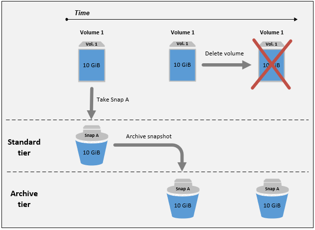
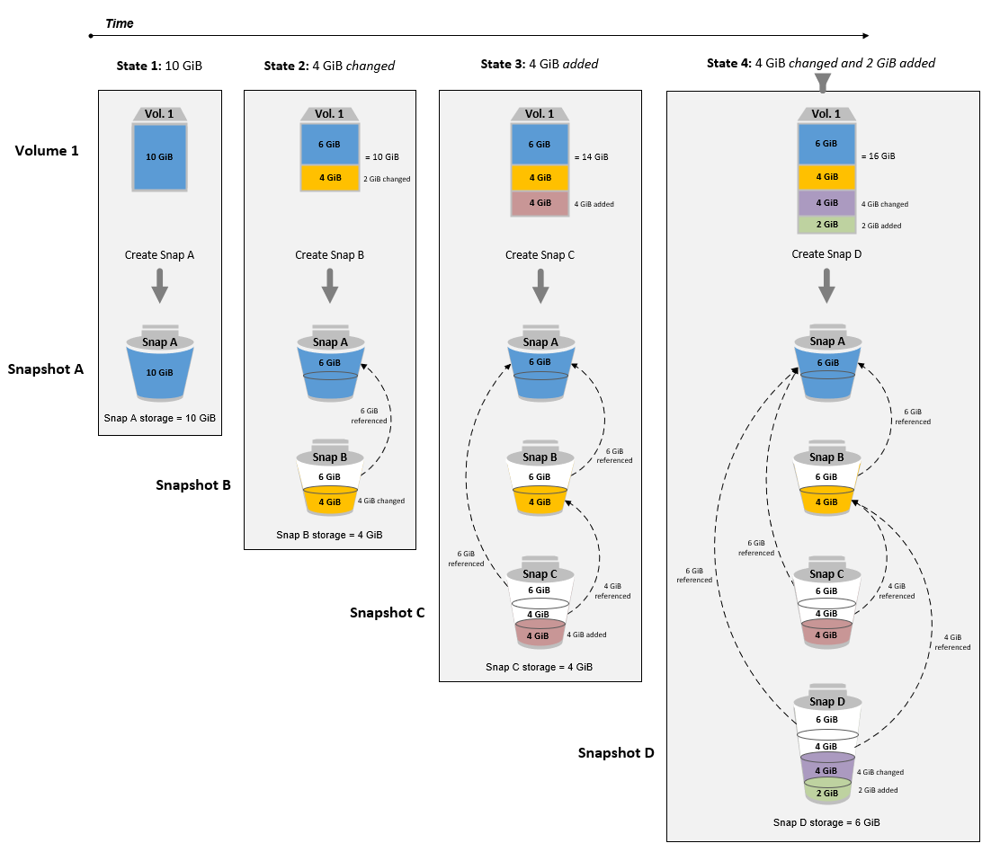
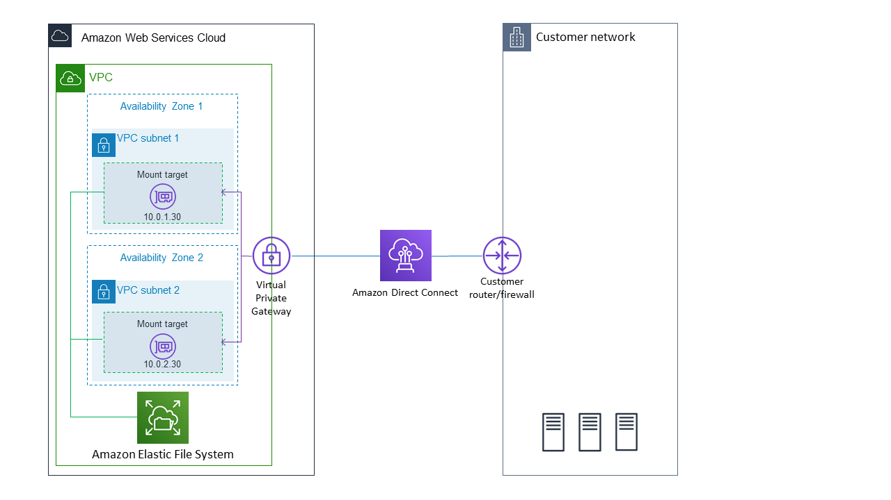

# 4. EC2 storage

### 1. [Amazon Elastic Block Store(Amazon EBS)](https://docs.aws.amazon.com/ko_kr/AWSEC2/latest/UserGuide/AmazonEBS.html)

- EC2 인스턴스에 사용할 수 있는 블록 수준 스토리지 볼륨을 제공
- 인스턴스에 디바이스로 마운트할 수 있습니다.
- 인스턴스에 연결된 EBS 볼륨은 스토리지 볼륨으로 표시되며, 인스턴스 수명에 관계없이 지속
- 데이터에 빠르게 액세스하고 장기적으로 지속해야 하는 경우 Amazon EBS를 사용

1. [기능](https://docs.aws.amazon.com/ko_kr/AWSEC2/latest/UserGuide/AmazonEBS.html#ebs-features)
   - EBS 볼륨을 생성한 다음 동일한 가용 영역에 있는 인스턴스에 연결
   - 가용 영역 외부에 볼륨을 제공하기 위해 스냅샷을 생성하고 해당 지역 어디서나 새 볼륨으로 복원
2. [장점](https://docs.aws.amazon.com/ko_kr/AWSEC2/latest/UserGuide/ebs-volumes.html#EBSFeatures)
   - [데이터 가용성](https://docs.aws.amazon.com/ko_kr/AWSEC2/latest/UserGuide/ebs-volumes.html#availability-benefit)
      - 단일 하드웨어 구성 요소의 장애로 인한 데이터 손실을 방지하기 위해 해당 가용 영역 내에서 자동으로 복제
   - [데이터 지속성](https://docs.aws.amazon.com/ko_kr/AWSEC2/latest/UserGuide/ebs-volumes.html#persistence-benefit)
      - 인스턴스의 수명에 관계없이 유지
      - 데이터가 유지되는 동안 볼륨 사용량에 대한 비용을 계속해서 지불
   - [데이터 암호화](https://docs.aws.amazon.com/ko_kr/AWSEC2/latest/UserGuide/ebs-volumes.html#encryption-benefit)
      - 단순 데이터 암호화의 경우 Amazon EBS 암호화 기능으로 암호화된 EBS 볼륨을 생성할 수 있습니다.
      - 모든 EBS 볼륨 유형은 암호화를 지원합니다.
      - AWS Key Management Service(AWS KMS) 마스터 키를 사용하여 암호화된 볼륨을 생성하고 암호화된 볼륨에서 모든 스냅샷을 생성
      - 암호화된 EBS 볼륨을 처음 생성할 때 기본 마스터 키가 자동으로 생성
   - [데이터 보안](https://docs.aws.amazon.com/ko_kr/AWSEC2/latest/UserGuide/ebs-volumes.html#security-benefit)
      - Amazon EBS 볼륨은 포맷되지 않은 원시 블록 디바이스로 제공
   - [스냅샷](https://docs.aws.amazon.com/ko_kr/AWSEC2/latest/UserGuide/ebs-volumes.html#backup-benefit)
      - EBS 볼륨의 스냅샷(백업)을 생성
      - 볼륨 내 데이터 사본을 다중 가용 영역에 중복 저장이 가능한 Amazon S3에 작성
      - 실행 중인 인스턴스에 연결되어있어도 스냅샷 생성 가능
   - [유연성](https://docs.aws.amazon.com/ko_kr/AWSEC2/latest/UserGuide/ebs-volumes.html#flexibility-benefit)
3. [스냅샷 아카이빙에 대한 지침 및 모범 사례](https://docs.aws.amazon.com/ko_kr/AWSEC2/latest/UserGuide/archiving-guidelines.html)
   - [볼륨의 유일한 스냅샷 아카이빙](https://docs.aws.amazon.com/ko_kr/AWSEC2/latest/UserGuide/archiving-guidelines.html#guidelines-single-snapshot)
      - 볼륨의 스냅샷이 하나만 있는 경우 스냅샷은 생성 시 볼륨에 기록된 블록과 항상 같은 크기
      - 스냅샷을 아카이빙하면 스토리지 비용을 절감
      - 
   - [단일 볼륨의 증분 스냅샷 아카이빙](https://docs.aws.amazon.com/ko_kr/AWSEC2/latest/UserGuide/archiving-guidelines.html#guidelines-incremental-snapshot)
      - 증분 스냅샷을 아카이빙하면 스냅샷이 전체 스냅샷으로 변환되고 아카이브 계층으로 이동
      - 
   - [규정 준수를 위해 전체 스냅샷 아카이빙](https://docs.aws.amazon.com/ko_kr/AWSEC2/latest/UserGuide/archiving-guidelines.html#guidelines-full-snapshot)
   - [표준 계층 스토리지 비용 절감 결정](https://docs.aws.amazon.com/ko_kr/AWSEC2/latest/UserGuide/archiving-guidelines.html#archive-guidelines)
4. [휴지통에서 스냅샷 복구](https://docs.aws.amazon.com/ko_kr/AWSEC2/latest/UserGuide/recycle-bin-working-with-snaps.html)
5. [볼륨 유형](https://docs.aws.amazon.com/ko_kr/AWSEC2/latest/UserGuide/ebs-volume-types.html)
   - [범용 SSD(gp3) 볼륨](https://docs.aws.amazon.com/ko_kr/AWSEC2/latest/UserGuide/general-purpose.html#gp3-ebs-volume-type)
      - Amazon EBS에서 제공하는 가장 저렴한 SSD 볼륨
      - 범용 SSD(gp2) 볼륨보다 GiB당 20% 저렴한 가격
   - [범용 SSD(gp2) 볼륨](https://docs.aws.amazon.com/ko_kr/AWSEC2/latest/UserGuide/general-purpose.html#EBSVolumeTypes_gp2)
      - EC2 인스턴스의 기본 Amazon EBS 볼륨 유형
   - [프로비저닝된 IOPS SSD(io1 및 io2) 볼륨](https://docs.aws.amazon.com/ko_kr/AWSEC2/latest/UserGuide/provisioned-iops.html#EBSVolumeTypes_piops)
      - 스토리지 성능과 일관성에 민감한 I/O 집약적 워크로드, 특히 데이터베이스 워크로드의 요구 사항을 충족하도록 설계
6. [다중 연결](https://docs.aws.amazon.com/ko_kr/AWSEC2/latest/UserGuide/ebs-volumes-multi.html)
- 단일 프로비저닝된 IOPS SSD(io1 또는 io2) 볼륨을 동일한 가용 영역에 있는 여러 인스턴스에 연결
- 다중 연결을 사용하면 동시 쓰기 작업을 관리하는 클러스터링된 Linux 애플리케이션에서 더 쉽게 더 높은 애플리케이션 가용성을 얻을 수 있습니다.
- 제한
   - Linux 인스턴스에 최대 16개까지 연결
   - 프로비저닝된 IOPS SSD(io1 및 io2) 볼륨에만 지원
   - XFS 및 EXT4와 같은 표준 파일 시스템 ❌
   - I/O 차단 기능 ❌
   - 부팅 볼륨 ❌
7. [Amazon EBS 암호화](https://docs.aws.amazon.com/ko_kr/AWSEC2/latest/UserGuide/EBSEncryption.html)
- 암호화된 볼륨 및 스냅샷을 생성할 때 AWS KMS keys를 사용
- 유휴 데이터 및 전송 중 데이터의 보안을 모두 보장
- [암호화 시나리오](https://docs.aws.amazon.com/ko_kr/AWSEC2/latest/UserGuide/EBSEncryption.html#encryption-examples)

### 2. [Amazon Elastic File System(AWS EFS)](https://aws.amazon.com/ko/efs/faq/)
[표준 스토리지 작동방식](https://docs.aws.amazon.com/efs/latest/ug/how-it-works.html)

[One Zone 작동 방식](https://docs.aws.amazon.com/efs/latest/ug/how-it-works.html)

[directconnect 작동 방식](https://docs.aws.amazon.com/efs/latest/ug/how-it-works.html)

1. 개념
- 파일 데이터를 공유하는 데 도움이 되는 서버리스 방식의 완전 탄력적인 파일 스토리지
- 자동으로 기가바이트에서 페타바이트 규모의 데이터로 확장
- 최소 비용이나 설정 비용❌, 사용한 만큼만 비용을 지불
- 사용 사례
  - EFS
    - 빅 데이터 및 분석, 미디어 처리 워크플로, 콘텐츠 관리, 웹 지원 및 홈 디렉터리와 같은 다양한 워크로드와 애플리케이션에 필요한 성능을 제공
  - Amazon EFS Standard
    - 최고 수준의 내구성과 가용성을 필요로 하는 워크로드
  - EFS One Zone
    - 개발, 구축 및 스테이징 환경과 같은 워크로드
    - 분석, 시뮬레이션 및 미디어 트랜스코딩과 다중 AZ 복원력이 필요하지 않은 온프레미스 데이터의 백업 또는 복제
- Amazon EFS, Amazon Elastic Block Store(Amazon EBS), Amazon S3 차이점
  - EBS
    - 단일 EC2 인스턴스에서 가장 짧은 지연 시간으로 데이터에 액세스해야 하는 워크로드
  - EFS
    - Amazon 컴퓨팅(EC2, 컨테이너, 서버리스) 및 온프레미스 서버와 함께 사용할 수 있는 파일 스토리지 서비스
  - Amazon S3
    - 객체 스토리지 서비스
- Network File System 버전 4(NFS v4) 프로토콜을 사용
1. 규모 및 성능
- 페타바이트 규모의 데이터를 저장
- 1개에서 수천 개의 Amazon Elastic Compute Cloud(EC2) 인스턴스가 동시에 파일 시스템에 연결

### 3. [Amazon EC2 인스턴스 스토어](https://docs.aws.amazon.com/ko_kr/AWSEC2/latest/UserGuide/InstanceStorage.html)

- 인스턴스에 블록 수준의 임시 스토리지
- 버퍼, 캐시, 스크래치 데이터, 기타 임시 콘텐츠와 같이 자주 변경되는 정보의 임시 저장에 적합
- 인스턴스 스토리지의 데이터는 관련 인스턴스의 수명 기간 동안만 지속
- 데이터 손실 사례
  - 기본 디스크 드라이브 오류
  - 인스턴스가 중지됨
  - 인스턴스가 최대 절전 모드로 전환됨
  - 인스턴스가 종료됨

### 99. 문제 

1. us-east-1a에서의 EC2 인스턴스를 종료하여, 이 인스턴스에 연결된 EBS 볼륨을 사용할 수 있게 되었습니다. 팀원이 us-east-1b의 EC2 인스턴스에 이 볼륨을 연결하려 했으나, 연결이 불가능한 상태입니다. 이 경우, 가능성이 있는 원인은 무엇일까요?

- ✅ EBS 볼륨은 가용영역으로 제한되어 있음

2. 루트 볼륨 유형과 데이터 저장을 위한 기타 EBS 볼륨 유형, 두 개의 EBS 볼륨으로 EC2 인스턴스를 실행했습니다. EC2 인스턴스는 한 달 후에 종료할 예정입니다. 각 EBS 볼륨에 **기본적**으로 나타날 행위 특성은 무엇일까요?

- ✅ 루트볼륨은 삭제, EBS 볼륨 유형은 유지

3. 노스버지니아 리전 us-east-1에서 AMI를 사용하면 어떤 AWS 리전에 있는 EC2 인스턴스라도 실행할 수 있습니다

- ✅ 아니요
- AMI는 특정 AWS 리전에 국한되며, 각 AWS 리전에는 고유한 AMI가 있습니다. 다른 AWS 리전에서 AMI를 사용해 EC2 인스턴스를 실행하는 것은 불가능하지만, 대상 AWS 리전으로 AMI를 복사해 EC2 인스턴스를 생성하는 것은 가능합니다.

4. 다음 중, EC2 인스턴스를 생성할 때 부팅 볼륨으로 사용할 수 있는 EBS 볼륨 유형은 무엇인가요?

- ✅ gp2, gp3, io1, io2, Magnetic(표준)

5. EBS 다중 연결이란 무엇일까요?

- ✅ 동일한 EBS 볼륨을 동일 AZ 상에 있는 다수의 EC2 인스턴스에 연결

6. EC2 인스턴스에 연결되어 있는, 암호화되지 않은 EBS 볼륨을 암호화하려 합니다. 어떻게 해야 할까요?

- ✅ 해당 EBS 스냅샷 생성, 해당 스냅샷 복사, 복사된 스냅샷 암호화, 암호화된 스냅샷으로 EBS 볼륨 재 생성

7. 대량의 데이터 세트를 처리하는, 다수의 AZ에 걸친 EC2 인스턴스 플릿이 있습니다. 동일한 데이터가 NFS 드라이브로서 모든 EC2 인스턴스에서 액세스할 수 있게 만들기 위해서는 어떤 방법을 추천할 수 있을까요?

- ✅ [EFS](#13-amazon-elastic-file-systemaws-efs)는 네트워크 파일 시스템(NFS)으로 여러 AZ 상에 있는 EC2 인스턴스에 동일한 파일 시스템을 마운트할 수 있게 해줍니다.
  
8. EC2 인스턴스에 호스팅된 애플리케이션에 고성능 로컬 캐시를 포함시키려 합니다. EC2 인스턴스 종료 시, 캐시가 소실되어도 문제가 없는 상황입니다. 이런 경우, 솔루션 아키텍트로서 어떤 스토리지 메커니즘을 추천할 수 있을까요?

- ✅ [EC2 인스턴스 스토어](#15-amazon-ec2-인스턴스-스토어)는 최적의 디스크 I/O 성능을 제공합니다.

9. 기반 스토리지에 310,000의 IOPS가 필요한 고성능 데이터베이스를 실행하고 있습니다. 어떤 방법을 추천할 수 있을까요?

- ✅ 인스턴스 스토어: 해당 사례에서는 IOPS 기준이므로 EC2 인스턴스 스토어를 선택해야 합니다.
- ❌ EBS io2 Block Express 드라이브 사응
- ❌ EBS io1 드라이브 사응
- ❌ EBS gp2 드라이브 사응