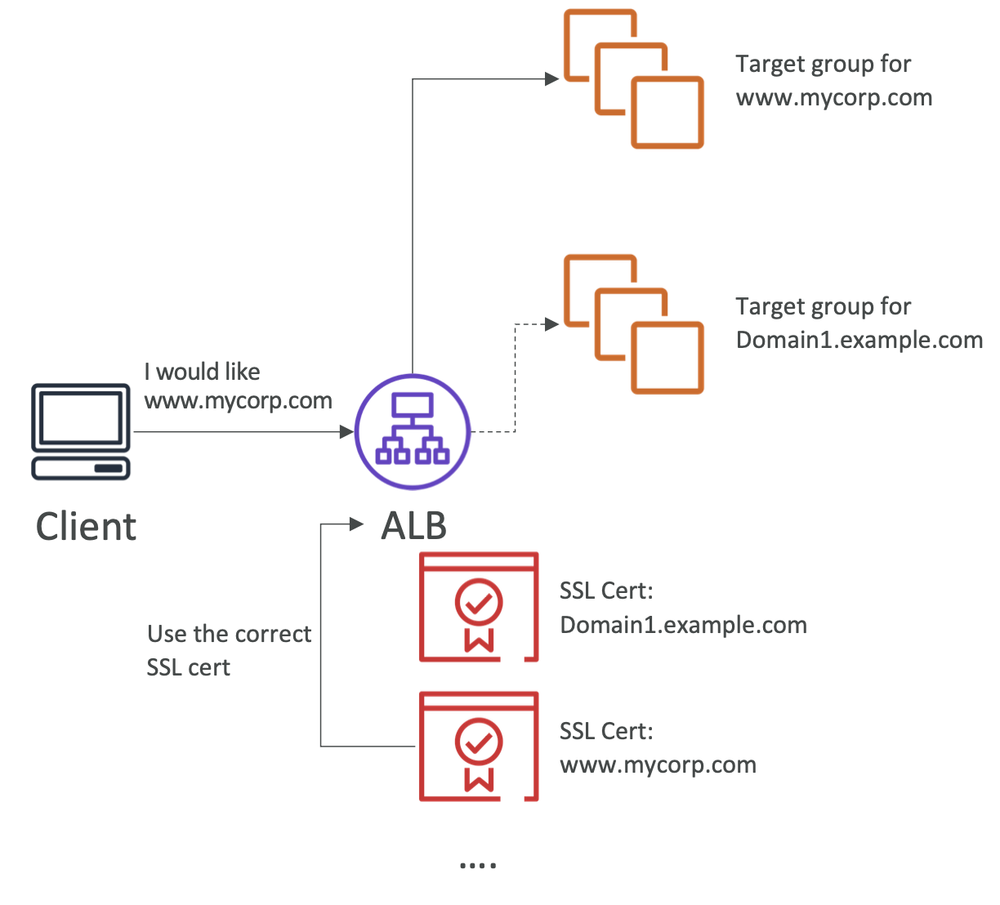
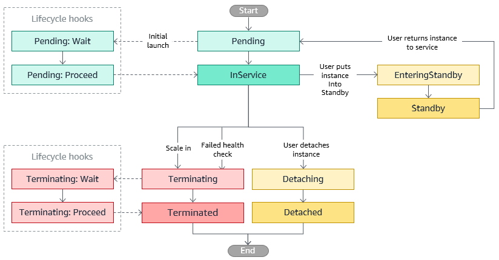

# 5. Scalability & HighAvailability

1. 확장성
- 수직 확장성
  - scale up⬆️/down⬇️
  - 인스턴스 크기 확장
  - 분산되지 않은 시스템(DB등)에 적용
- 수평 확장성
  - scale out⬆️/in⬇️
  - 인스턴스 갯수 확장

2. 고가용성
- 수평 확장성 ❌
- 시스템이 적어도 둘 이상의 데이터 센터에서 가동 중인 것
- 센터 하나가 멈춰도 작동이 가능하게 하는 것

3. 로드 밸런스
- what?
  - 트래픽을 전달
- why?
  - 서버의 부하를 분산하기 위해
  - 접근 할 수 있는 단일 액세스 지점(DNS) 노출을 위해
  - 다운스트림 인스턴스의 장애를 원할하게 처리하기 위해
  - 정기적인 health check를 위해
  - https 트래픽을 가지기 위해
  - 지역간 고가용성을 위해
  - public traffic와 private traffic을 분리하기 위해

### 1. [Application Load Balancer(ALB)](https://docs.aws.amazon.com/ko_kr/elasticloadbalancing/latest/application/introduction.html)

- Layer 7(HTTP)
- 머신간의 라우팅
- 동일 인스턴스의 부하 분산
- HTTP/2 Websocket 지원
- 리다이렉트 지원(예를들어 HTTP에서 HTTPS로)
- Docker & ECS에 적합
1. target group
- instance
 - 대상이 인스턴스 ID에 의해 지정됩니다.
- ip
 - 대상이 IP 주소입니다.
- lambda
 - 대상이 Lambda 함수입니다.
- health check
 - target group level
2. [sticky session](https://docs.aws.amazon.com/ko_kr/elasticloadbalancing/latest/application/sticky-sessions.html)
- 고정 세션 기능(세션 어피니티라고도 함)을 사용해 로드 밸런서가 사용자의 세션을 특정 대상에 바인딩
- 클라이언트가 쿠키를 지원해야 함
- Duration-based Cookies
 - 로드 밸런서 생성 쿠키(**AWSALB**)를 사용
 - 후속 요청에서 클라이언트는 **AWSALB** 쿠키를 포함해야 함
 - 로드 밸런서는 쿠키를 포함하는 클라이언트로부터 요청을 수신하면 이를 감지하고 해당 요청을 동일한 대상으로 라우팅
- Application-based Cookies
 - 쿠키 이름에는 **AWSALB**, **AWSALBAPP** 또는 **AWSALBTG**을(를) 사용 ❌. 이 단어는 로드 밸런서에서 사용하도록 예약되어 있음.
3. [대상 그룹을 위한 교차 영역 로드 밸런싱](https://docs.aws.amazon.com/ko_kr/elasticloadbalancing/latest/application/disable-cross-zone.html)

- 기본적으로 활성화
- target group level에서 비활성화 가능
- AZ간 데이터 요금에 대한 비용 ❌

### 2. [Network Load Balancer(NLB)](https://docs.aws.amazon.com/ko_kr/elasticloadbalancing/latest/network/introduction.html)

- Layer 4
  - TCP & UDP
  - 초당 수백만개 핸들링
  - Latency ~100ms (vs 400ms for ALB)
- 가용 영역당 고정ip, EIP 지원
- 극한의 성능, TCP & UDP 통신에 사용
- 프리티어에 포함 ❌
1. target group
- instance
 - 대상이 인스턴스 ID에 의해 지정됩니다.
- ip
 - 대상이 IP 주소에 의해 지정됩니다.
- alb
 - 대상이 Application Load Balancer입니다.
- health check
 - TCP, UDP, HTTPS Protocol
2. 교차 영역 로드 밸런싱
- 기본적으로 비활성화
- AZ간 데이터 요금에 대한 비용 부과(활성화시)

### 3. [Gateway Load Balancer](https://docs.aws.amazon.com/ko_kr/elasticloadbalancing/latest/gateway/introduction.html)

- Layer 3
- 모든 포트에서 모든 IP 패킷을 수신하고 리스너 규칙에 지정된 대상 그룹으로 트래픽을 전달
- **포트 6081**의 [**GateEVE 프로토콜**](https://datatracker.ietf.org/doc/html/rfc8926)을 사용하여 애플리케이션 트래픽을 교환
1. tatget group
- instance
 - 대상이 인스턴스 ID에 의해 지정됩니다.
- ip
 - 대상이 IP 주소에 의해 지정됩니다.
2. 교차 영역 로드 밸런싱
- 기본적으로 비활성화
- AZ간 데이터 요금에 대한 비용 부과(활성화시)

### 4. [SSL/TSL](https://aws.amazon.com/ko/what-is/ssl-certificate/)
- SSL
  - **S**ecure **S**ockets **L**ayer
  - 연결을 암호화할 수 있음.
- TSL
  - **T**ransport **L**ayer **S**ecurity
  - SSL의 새로운 버전

- Load Balancer는 **X.509 인증서**를 사용
- 인증서를 **ACM**(AWS Certificate Manager)에서 관리할 수 있음
- 본인의 인증서를 업로드 할 수 있음
- HTTPS 리스너는
  - 반드시 기본 인증서를 지정해야 함
  - 다수의 도매인을 지원하기 위해 다른 인증서를 추가할 수 있으며
  - [SNI](#5-server-name-indicationsni)를 사용하여 호스트이름을 지정할 수 있다.
  - 지난 버전의 SSL/TSL을 지원하는 보안 정색을 지정할 수 있다.

### 5. Server Name Indication(SNI)

- 하나의 웹서버에 다수의 인증서를 로드할 수 있음
- 최초의 SSL 핸드쉐이킹에서 대상 서버의 호스트 네임을 요구함.
- ALB, NLB, CloudFront에서만 동작함

### 6. Deregistration Delay
- [ALB](https://docs.aws.amazon.com/ko_kr/elasticloadbalancing/latest/application/load-balancer-target-groups.html#deregistration-delay)
- [NLB](https://docs.aws.amazon.com/ko_kr/elasticloadbalancing/latest/network/load-balancer-target-groups.html#deregistration-delay)

### 7. [Auto Scaling(ASG)](https://docs.aws.amazon.com/ko_kr/autoscaling/ec2/userguide/what-is-amazon-ec2-auto-scaling.html)

- 애플리케이션의 로드를 처리할 수 있는 정확한 수의 Amazon EC2 인스턴스를 유지

1. [장점](https://docs.aws.amazon.com/ko_kr/autoscaling/ec2/userguide/auto-scaling-benefits.html)
- 향상된 내결함성
- 가용성 향상
- 비용 관리 향상

2. [수명주기](https://docs.aws.amazon.com/ko_kr/autoscaling/ec2/userguide/ec2-auto-scaling-lifecycle.html)

3. [With Load Balancer](https://docs.aws.amazon.com/ko_kr/autoscaling/ec2/userguide/autoscaling-load-balancer.html)

- 요구 사항
  - 로드 밸런서와 그 대상 그룹은 오토 스케일링과 동일한 AWS 계정, VPC 및 리전
  - 대상 그룹은 대상 유형으로 instance를 지정, IP ❌
  - 로드 밸런서의 트래픽이 Auto Scaling 그룹에 도달할 수 있도록 시작 템플릿 또는 시작 구성에 보안 그룹을 설정

- [Auto Scaling 그룹에 로드 밸런서 연결](https://docs.aws.amazon.com/ko_kr/autoscaling/ec2/userguide/attach-load-balancer-asg.html)

- [CloudWatch 지표 모니터링](https://docs.aws.amazon.com/ko_kr/autoscaling/ec2/userguide/ec2-auto-scaling-cloudwatch-monitoring.html)

4. [그룹 조정](https://docs.aws.amazon.com/ko_kr/autoscaling/ec2/userguide/scale-your-group.html)

- [원하는 최소 및 최대 그룹 크기를 나타냄. 최소 및 최대 크기에 대해 별도로 제한을 설정](https://docs.aws.amazon.com/ko_kr/autoscaling/ec2/userguide/asg-capacity-limits.html)
- [일정한 수의 인스턴스 유지 가능](https://docs.aws.amazon.com/ko_kr/autoscaling/ec2/userguide/as-maintain-instance-levels.html)
- [수동 조정](https://docs.aws.amazon.com/ko_kr/autoscaling/ec2/userguide/as-manual-scaling.html)
- [동적 조정](https://docs.aws.amazon.com/ko_kr/autoscaling/ec2/userguide/as-scale-based-on-demand.html)
  - 트래픽의 변화에 따라 Auto Scaling 그룹의 용량을 조정
  - 동적 조정 정책은 Amazon EC2 Auto Scaling에 특정 CloudWatch 지표를 추적하도록 지시하며, 연결된 CloudWatch 경보가 경보 상태일 때 수행할 작업을 정의
  - 동적 조정 정책을 지원
    - [대상 추적 조정(Target tracking scaling)](https://docs.aws.amazon.com/ko_kr/autoscaling/ec2/userguide/as-scaling-target-tracking.html)
      - Amazon CloudWatch 지표와 애플리케이션의 이상적인 평균 사용률 또는 처리량(throughput) 수준을 나타내는 목표 값을 지정
      - [지표 선택](https://docs.aws.amazon.com/ko_kr/autoscaling/ec2/userguide/as-scaling-target-tracking.html#target-tracking-choose-metrics)
        - **ASGAverageCPUUtilization** - Auto Scaling 그룹의 평균 CPU 사용률.
        - **ASGAverageNetworkIn** - 모든 네트워크 인터페이스에서 단일 인스턴스가 받은 평균 바이트 수
        - **ASGAverageNetworkOut** - 모든 네트워크 인터페이스에서 단일 인스턴스가 보낸 평균 바이트 수
        - **ALBRequestCountPerTarget** - 대상당 평균 Application Load Balancer 요청 수
    - [단계 조정(Step scaling)과 단순 조정(Simple scaling)](https://docs.aws.amazon.com/ko_kr/autoscaling/ec2/userguide/as-scaling-simple-step.html)
      - 조정 프로세스를 호출하는 CloudWatch 경보에 대한 조정 지표와 임계값을 선택
      - 대부분의 경우에는 단계 조정 정책이 단순 조정 정책보다 더 좋음
  - [조정 휴지(Scaling Cooldowns)](https://docs.aws.amazon.com/ko_kr/autoscaling/ec2/userguide/ec2-auto-scaling-scaling-cooldowns.html)
    - 인스턴스를 시작하거나 종료한 후 단순 조정 정책에 의해 시작된 추가 조정 활동이 시작되기 전에 휴지 기간이 끝날 때까지 대기
    - 목적은 Auto Scaling 그룹이 이전 활동의 효과가 나타나기 전에 추가 인스턴스를 시작하거나 종료하는 것을 방지
    - 기본적으로 휴지 기간은 300초(5분)로 설정
- [예약된 조정(Scheduled Actions)](https://docs.aws.amazon.com/ko_kr/autoscaling/ec2/userguide/ec2-auto-scaling-scheduled-scaling.html)
  -  예약된 작업이 시간 및 날짜 함수에 따라 자동으로 수행
- [예측 조정(Predictive Scaling)](https://docs.aws.amazon.com/ko_kr/autoscaling/ec2/userguide/ec2-auto-scaling-predictive-scaling.html)
  - 트래픽 흐름의 일일 및 주간 패턴을 통해 인스턴스 수 조절
  - 기계 학습을 사용하여 CloudWatch의 기록 데이터를 기반으로 용량 필요량을 예측

### 99. 문제

1. EC2 인스턴스를r4.large에서 r4.4xlarge로 확장하는 것은 .....................(이)라고 합니다.

- ✅ 수직적 스케일링

2. EC2 인스턴스의 수를 스케일링하는 오토 스케일링 그룹을 실행하는 것은 .....................(이)라고 합니다.

- ✅ 수평적 스케일링

3. Elastic Load Balancer는 .......................(을)를 제공합니다.

- ❌ 애플리케이션에서 사용 가능한 정적 IPv4 주소
- ✅ 애플리케이션에서 사용 가능한 정적 DNS 이름
- ❌ 애플리케이션에서 사용 가능한 정적 IPv6 주소

4. Elastic Load Balancer가 관리하는 10개의 EC2 인스턴스 상에서 웹사이트를 실행 중입니다. 웹사이트의 사용자들은 웹사이트에서 다른 페이지로 이동할 때마다 새로 인증을 해야한다는 점에 대해 불만을 토로하고 있습니다. 하지만 여러분의 기기와 하나의 EC2 인스턴스를 지닌 개발 환경에서는 아무 문제 없이 작동을 하고 있기 때문에 곤혹스러운 상황입니다. 무엇이 원인일까요?

- ✅ ELB에서 고정 세션을 활성화하지 않음

5. Application Load Balancer를 사용해 EC2 인스턴스에서 호스팅된 웹사이트의 트래픽을 분배하고 있습니다. 그런데 여러분의 웹사이트가 Application Load Balancer의 IP 주소인 사설 IPv4 주소에서 들어오는 트래픽만을 확인하고 있는 것으로 나타났습니다. 이런 경우, 웹사이트로 연결된 클라이언트들의 IP 주소를 받으려면 어떻게 해야 할까요?

- ✅ 웹사이트의 백엔드에서 X-Forwarded-For 해더로부터 클라이언트 IP를 가져오도록 수정

6. Elastic Load Balancer가 관리하는 한 세트의 EC2 인스턴스 상에 애플리케이션을 호스팅했습니다. 일주일 후, 사용자들은 가끔씩 애플리케이션이 작동하지 않는다며 호소하기 시작했습니다. 문제점을 조사한 결과, 일부 EC2 인스턴스가 이따금 충돌한다는 문제점이 발견되었습니다. 사용자들이 충돌하는 EC2 인스턴스에 연결되지 않도록 보호하기 위해서는 어떻게 해야 할까요?

- ✅ [ELB 상태 확인 활성화](https://docs.aws.amazon.com/ko_kr/autoscaling/ec2/userguide/as-add-elb-healthcheck.html)

7. 어떤 기업에서 솔루션 아키텍트로 근무하고 있는 여러분은 1초에 수백만 개의 요청을 받게 될 고성능의, 그리고 지연 시간이 적은 애플리케이션을 위한 아키텍처를 설계해달라는 요청을 받았습니다. 다음 중 어떤 종류의 Elastic Load Balancer를 사용해야 할까요?

- ✅ NLB

8. Application Load Balancer가 지원하지 않는 프로토콜을 고르세요.

- ✅ TCP

9. Application Load Balancer는 트래픽을 다른 대상 그룹으로 라우팅할 수 있습니다. 이때 확인할 내용으로 사용할 수 없는 것을 고르세요

- ✅ ALB는 URL 경로, 호스트 이름, HTTP 헤더 및 쿼리 문자열을 기반으로 트래픽을 다른 대상 그룹으로 라우팅할 수 있습니다.

10. Application Load Balancer의 대상 그룹에 등록된 대상이 될 수 없는 것을 고르세요.

- ✅ NLB

11. 규정 준수를 위해, 고정된 정적 IP 주소를 최종 사용자에게 노출하여 사용자들이 안정적이고, 규제 기관의 승인을 받은 방화벽 규칙을 작성할 수 있도록 하려 합니다. 이런 경우, 다음 중 어떤 종류의 Elastic Load Balancer를 사용해야 할까요?

- ✅ Network Load Balancer는 AZ 당 하나의 정적 IP 주소를 가지며, 여기에 탄력적 IP 주소를 연결할 수 있습니다. Application Load Balancer와 Classic Load Balancer를 정적 DNS 이름으로 사용할 수 있습니다.

12. Application Load Balancer 내에 사용자 지정 애플리케이션 기반 쿠키를 생성하려 합니다. 다음 중 쿠키의 이름으로 사용 가능한 것은 무엇인가요?

- ✅ 다음의 쿠키 이름은 ELB가 선점하고 있습니다(AWS**ALB**, AWS**ALB**APP, AWS**ALB**TG).

13. us-east-1에 있는 한 세트의 EC2 인스턴스에 트래픽을 배분하는 Network Load Balancer가 있습니다. us-east-1b AZ에 2개의 EC2 인스턴스, us-east-1e AZ에는 5개의 EC2 인스턴스가 있습니다. 여러분은 us-east-1b AZ에 있는 EC2 인스턴스의 CPU 사용률이 더 높다는 것을 발견했습니다. 조사를 거친 결과, 두 개의 AZ에 걸쳐 분배된 트래픽의 양은 동일한 것으로 나타났습니다. 이 경우, 어떻게 문제를 해결해야 할까요?

- ✅ 영역간 로드 밸런싱 활성화

14. 다음 중 하나의 리스너로 다수의 SSL 인증서를 가져올 수 있도록 해주는 Application Load Balancer와 Network Load Balancer의 기능은 무엇인가요?

- ✅ SNI

15. 다음과 같은 호스트 이름을 기반으로, 트래픽을 3개의 대상 그룹으로 리다이렉팅하도록 구성된 Application Load Balancer가 있습니다: users.example.com, api.external.example.com, checkout.example.com. 이 각각의 호스트 이름에 HTTPS를 구성하려 합니다. 이런 작업을 위해서는 ALB를 어떻게 구성해야 할까요?

- ✅ SNI 사용

16. 원하는 용량과 최대 용량을 모두 3으로 구성한 오토 스케일링 그룹에 의해 관리되고 있는, 한 세트의 EC2 인스턴스에 호스팅된 애플리케이션이 있습니다. 또한, CPU 사용률이 60%에 이르면 ASG를 스케일 아웃하도록 구성된 CloudWatch 경보도 생성해 뒀습니다. 해당 애플리케이션은 현재 갑자기 많은 양의 트래픽을 전송 받아 80% CPU 사용률에서 실행되고 있는 상태입니다. 이런 경우, 무슨 일이 일어나게 될까요?

- ✅ 아무 일어나지 않음.(최대 용량을 넘을 수 없음)

17. Application Load Balancer가 관리하는 오토 스케일링 그룹이 있습니다. ASG가 ALB 상태 확인을 사용하도록 구성을 해둔 상태인데, EC2 인스턴스가 비정상인 것으로 보고되었습니다. EC2 인스턴스에는 무슨 일이 일어나게 될까요?

- ✅ ASG가 EC2를 종료(EC2 인스턴스가 ALB의 상태 확인에 실패할 경우, 이는 비정상인 것으로 표시되어 종료되며 ASG는 새로운 EC2 인스턴스를 실행)

18. 여러분의 상사가 애플리케이션이 데이터베이스로 보내는 분당 요청 수를 기반으로 오토 스케일링 그룹을 스케일링하라고 요청했습니다. 어떻게 해야 할까요?

- ✅ CloudWatch 사용자 지정 지표를 생성한 후 ASG를 스케일링 하기위한 CloudWatch 경보 설정
- ❗️백엔드-데이터베이스 연결에는 ‘분당 요청'에 해당하는 CloudWatch 지표가 존재하지 않습니다. CloudWatch 경보를 생성하려면 CloudWatch 사용자 지정 지표를 먼저 생성해야 합니다.

19. 한 애플리케이션이 애플리케이션 로드 밸런서(ALB)와 오토 스케일링 그룹(ASG)을 통해 배포되었습니다. 이 상태에서 ASG의 크기를 수동으로 조정해 EC2 인스턴스의 평균 연결 개수가 약 1,000개가 되도록 조정 정책을 정의하려고 합니다. 어떤 조정 정책을 사용해야 합니까?

- ❓대상 추적 조정 정책

20. 오토 스케일링 그룹(ASG)과 네트워크 로드 밸런서로 구성된 환경이 있습니다. ASG에 있는 애플리케이션은 HTTP 프로토콜을 지원하고 로드 밸런서 상태 확인(Health Check)을 사용하도록 설정돼 있습니다. 다음 중 현재 사용하고 있는 TCP 상태 확인을 HTTP 상태 확인으로 변경하는 방법은 무엇입니까?

- ✅ 상태 확인 방식은 HTTP로 변경한다
- ❗️NLB는 TCP, HTTPS 및 HTTP 상태 확인을 지원합니다.

21. 한 웹 사이트가 애플리케이션 로드 밸런서 뒤에 있는 오토 스케일링 그룹의 EC2 인스턴스에서 호스팅되고 있습니다. 현재 HTTP로 서비스 중인 웹 사이트를 HTTPS로 바꾸는 작업을 진행하고 있습니다. ACM 인증서를 발급받아 애플리케이션 로드 밸런서에 적용한 상태입니다. 사용자들이 HTTP가 아닌 HTTPS를 사용해 웹 사이트에 접속하게 하려면 어떻게 해야 합니까?

- ✅ ALB가 HTTP를 HTTPS로 리디렉션하도록 설정.