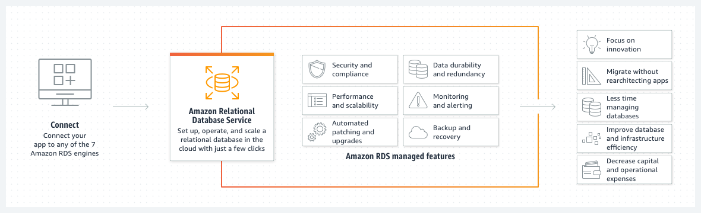

# 6. RDS, Aurora & EkastiCache

### 1. [RDS](https://docs.aws.amazon.com/ko_kr/AmazonRDS/latest/UserGuide/Welcome.html)

1. [개요](https://docs.aws.amazon.com/ko_kr/AmazonRDS/latest/UserGuide/Welcome.html#Welcome.Concepts)

- 관리모델 비교

|특징|온프레미스|EC2|RDS|
|:---|:---:|:---:|:---:|
|애플리케이션 최적화|고객|고객|고객|
|확장성|고객|고객|AWS|
|고가용성|고객|고객|AWS|
|DB백업|고객|고객|AWS|
|DB설치|고객|고객|AWS|
|DB패치|고객|고객|AWS|
|OS패치|고객|고객|AWS|
|OS설치|고객|고객|AWS|
|서버유지관리|고객|AWS|AWS|
|HW수명|고객|AWS|AWS|
|전력,네트워크,냉각|고객|AWS|AWS|

- [DB 인스턴스](https://docs.aws.amazon.com/ko_kr/AmazonRDS/latest/UserGuide/Welcome.html#Welcome.Concepts.DBInstance)
  - 엔진
    - MariaDB
    - Microsoft SQL Server
    - MySQL
    - Oracle
    - PostgreSQL
  - DB 인스턴스 스토리지
    - 범용(SSD)
    - 프로비저닝된 IOPS(PIOPS)
    - Magnetic

- [Amazon RDS 모니터링](https://docs.aws.amazon.com/ko_kr/AmazonRDS/latest/UserGuide/Welcome.html#Welcome.Monitoring)
  - Amazon CloudWatch 서비스를 사용하여 DB 인스턴스의 성능 및 상태를 모니터링
  - 이벤트를 구독해 DB 인스턴스, DB 스냅샷, DB 파라미터 그룹이 변경될 때마다 알림 수신 가능

- [Amazon RDS 작업 방법](https://docs.aws.amazon.com/ko_kr/AmazonRDS/latest/UserGuide/Welcome.html#Welcome.Interfaces)
  - AWS Management Console
  - AWS Command Line Interface(AWS CLI)
  - Amazon RDS API
  - SSH ❌

- [Amazon RDS 스토리지 Autoscaling을 사용한 용량 자동 관리](https://docs.aws.amazon.com/ko_kr/AmazonRDS/latest/UserGuide/USER_PIOPS.StorageTypes.html#USER_PIOPS.Autoscaling)
  - 스토리지 자동 크기 조정이 활성화된 상태에서 Amazon RDS가 데이터베이스의 여유 공간이 부족한 것을 감지하면 자동으로 스토리지를 확장
  - 다음과 같은 요인이 적용될 때 자동 크기 조정이 활성화된 DB 인스턴스에서 스토리지 수정을 시작
    - 사용 가능한 여유 공간이 할당된 스토리지의 10% 미만일 때
    - 낮은 스토리지 조건이 5분 이상 지속될 때
    - 마지막 스토리지 수정 이후 최소 6시간 경과 시 또는 인스턴스의 스토리지 최적화 완료 시 중 더 긴 시간으로 설정합니다.
  - 추가 스토리지는 다음 중 더 큰 값만큼 증가
    - 5GiB
    - 현재 할당된 스토리지의 10퍼센트
    - 지난 시간 동안의 FreeStorageSpace 지표 변화에 따라 7시간의 스토리지 증가 예측 지표(CloudWatch)
  - 제약 사항
    - 최대한도를 현재 할당된 스토리지보다 최소 10% 이상 크게 설정(이벤트 알람을 차단하려면 26%)
    - (IOPS인 경우) IOPS 대 최대 스토리지 임계값(GiB)은 RDS for SQL Server에서 1~50, 기타 RDS DB 엔진에서 0.5~50
    - 데이터베이스 엔진 및 DB 인스턴스 클래스에 할당된 최대 스토리지보다 큰 값으로 설정 ❌
  - [제한 사항](https://docs.aws.amazon.com/ko_kr/AmazonRDS/latest/UserGuide/USER_PIOPS.StorageTypes.html#autoscaling-limitations)
    - 증분 후 임계값이 같거나 높으면 ❌
    - 자동 크기 조정시 임계값을 초과할 것 같으면 그보다 작게 조정
    - 자동 크기 조정 후 6시간동안 휴지시간을 가짐. 그 안에는 ❌
    - 수동 조정과 Auto Scaling이 동시에 발생하면 수동조정이 우선
    - 마그네틱 스토리지 사용 ❌

2. Read Replicas & Multi AZ

- [Read Replacas](https://docs.aws.amazon.com/ko_kr/AmazonRDS/latest/UserGuide/USER_ReadRepl.html)
  - MariaDB, Microsoft SQL Server, MySQL, Oracle 및 PostgreSQL DB 엔진의 기본 복제 기능을 사용
  - 원본 DB 인스턴스가 기본 DB 인스턴스
  - 기본 DB 인스턴스에 적용된 업데이트는 읽기 전용 복제본에 **비동기식**으로 복사
  - 읽기 전용 복제본을 독립 DB 인스턴스로 승격 가능. 비용 ❌
  - 다른 AWS 리전에서 읽기 전용 복제본 생성 가능, 비용 발생

**Read Replacas**

**Standby Read Replaces**

**읽기 전용 복제본을 독립 DB 인스턴스로 승격**

**다른 AWS 리전에서 읽기 전용 복제본 생성**

- [Multi AZ](https://docs.aws.amazon.com/ko_kr/AmazonRDS/latest/UserGuide/Concepts.MultiAZ.html)

